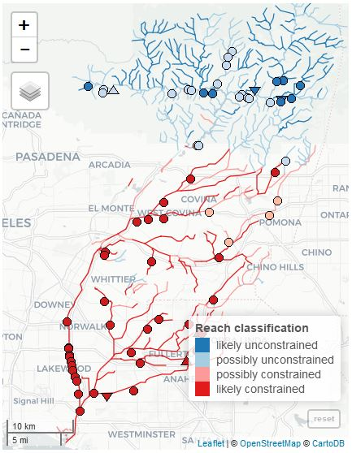

SCCWRP and its partners have developed an interactive application to help prioritize management actions for streams in the San Gabriel River watershed. The new tool, SCAPE (Stream Classification and Priority Explorer), was released online this month.

The interactive application was developed in partnership with a regional stakeholder group from the San Gabriel River watershed to help identify locations for recommending management priorities. The application successfully identified streams where management actions are expected to have intended outcomes within the constraints of landscape pressures.

The tool was recently released online as part of a statewide model for classifying stream health in the context of expected conditions. This interactive data product is a new approach to delivering research products at SCCWRP that can effectively address stakeholders needs for applied science.

```{r fig.cap = 'Screenshot from the new SCAPE application', echo = F, out.width = 2}

```

Link: TBD